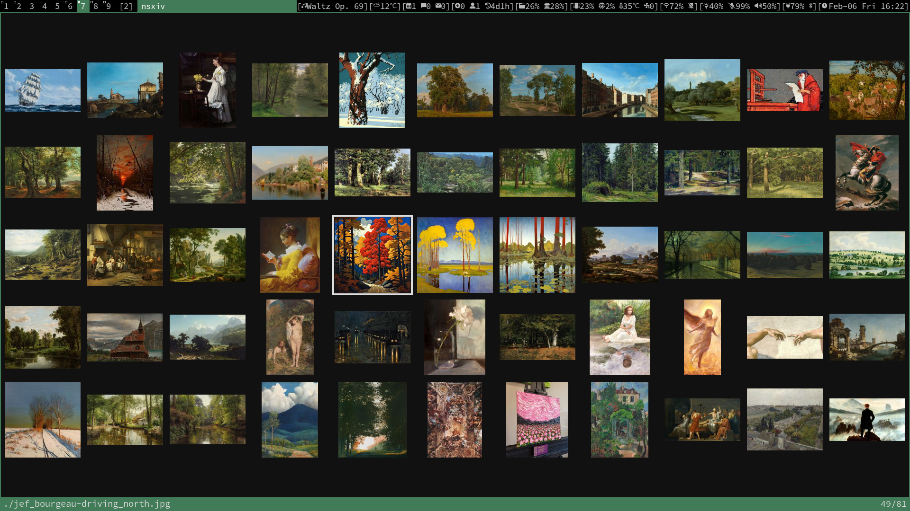

#  my build of of [nsxiv](https://codeberg.org/nsxiv/nsxiv) - Neo Simple X Image Viewer
  
nsxiv v33

nsxiv is a fork of the now-unmaintained [sxiv](https://github.com/xyb3rt/sxiv)
with the purpose of being a (mostly) drop-in replacement for sxiv, maintaining its
interface and adding simple, sensible features. nsxiv is free software licensed
under GPL-2.0-or-later and aims to be easy to modify and customize.

### Patches applied
1. [color-invert](https://codeberg.org/nsxiv/nsxiv-extra/src/branch/master/patches/color-invert)
2. [dmenu-search](https://codeberg.org/nsxiv/nsxiv-extra/src/branch/master/patches/dmenu-search)
3. [nav-dir](https://codeberg.org/nsxiv/nsxiv-extra/src/branch/master/patches/nav-dir)
4. [zoom-per-image](./patches/zoom-per-image-v33.diff)

### scripting
Below are some of my scripts utilizing nsxiv:
- [key-handler](https://codeberg.org/unixchad/dotfiles/src/branch/master/.config/nsxiv/exec/key-handler)
- [url-rifle](https://codeberg.org/unixchad/dotfiles/src/branch/master/.local/bin/url-rifle)
- [qute-code](https://codeberg.org/unixchad/dotfiles/src/branch/master/.local/bin/qutebrowser/qute-code)

### Wayland
Swayimg is the most close-to-nsxiv(in functionality) Wayland-native image viewer. Here are my swayimg [config](https://codeberg.org/unixchad/dotfiles/src/branch/master/.config/swayimg) and external [scripts](https://codeberg.org/unixchad/dotfiles/src/branch/master/.local/bin/swayimg).
